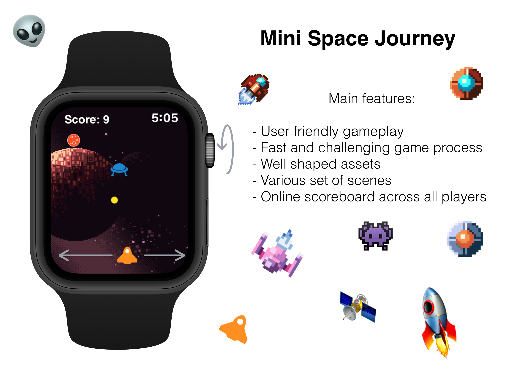

# Mini Space Journey

This is the copy of the Space Invandors and my first game in swift 5 expirience.

## Version 0.0.1 

### Gameplay

## Stack:

Most of the logic done with `WatchKit`, `UIKite` and of course `SpriteKit`

For `sqlite` I use this lib: https://github.com/stephencelis/SQLite.swift

## Goal

- [ ] 50 Github stars - standalone WacthOS game with free access on AppStore
- [ ] 100 Github stars - Score board with highest score across all users
- [ ] 150 Github stars - 3 different enviroments (8bit style, fancy vector, funny one) 1 month for free then i will add symbolic price for 3$ for people who would like to support me 